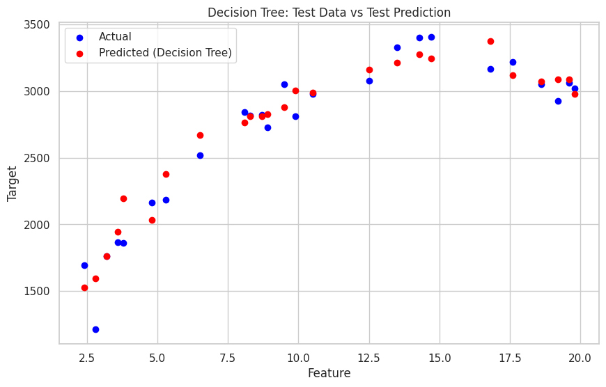

# Salary Prediction: Regression Analysis

## Project Overview
This project aims to predict the salary of employees based on their years of experience using supervised machine learning techniques. Two regression models, Linear Regression and Decision Tree Regression, are implemented and compared.



---

## Dataset Information
- **Dataset Name**: `salary_data.csv`
- **Columns**:
  - `employee_id`: Unique identifier for each employee.
  - `experience_years`: Years of experience of the employee.
  - `salary`: Salary of the employee.

---

## Workflow
### 1. Data Ingestion
- Dataset is read and loaded using `pandas`.
- Initial exploration is done with:
  - `data.head()`
  - `data.info()`
  - `data.describe()`

### 2. Exploratory Data Analysis (EDA)
- A scatter plot visualizes the relationship between `experience_years` and `salary` using `seaborn` and `matplotlib`.

### 3. Data Preparation
- Checked for duplicates and removed them.
- Checked for missing values (none found).
- Dataset was split into predictors (`X`) and target (`y`).
- Data was further split into training and testing sets:
  - Train/Test Ratio: 75/25

### 4. Model Implementation
#### a. Linear Regression
- Fitted a linear regression model using `sklearn.linear_model.LinearRegression`.
- Plotted actual vs predicted values.
- Evaluated using:
  - Mean Squared Error (MSE)
  - R-squared (R²) score

#### b. Decision Tree Regression
- Fitted a decision tree regressor using `sklearn.tree.DecisionTreeRegressor`.
- Plotted actual vs predicted values.
- Evaluated using:
  - Mean Squared Error (MSE)
  - R-squared (R²) score

---

## Results
### Linear Regression
- Model Equation: `y = 1641.366 + 103.197 * x`
- Evaluation Metrics:
  - **Train MSE**: 107699.85
  - **Test MSE**: 128111.12
  - **Train R²**: 0.77
  - **Test R²**: 0.63

### Decision Tree Regression
- Evaluation Metrics:
  - **Train MSE**: 88.12
  - **Test MSE**: 128311.56
  - **Train R²**: 1.00
  - **Test R²**: 0.61

---

## Dependencies
- Python 3.8+
- Libraries:
  - `pandas`
  - `numpy`
  - `matplotlib`
  - `seaborn`
  - `scikit-learn`

---

## Usage
1. Install required libraries:
   ```bash
   pip install pandas numpy matplotlib seaborn scikit-learn
   ```
2. Run the script in your Python environment.
3. Ensure the `salary_data.csv` file is in the working directory.

---

## Key Insights
- There is a strong positive correlation between years of experience and salary.
- Linear regression provides a simpler model but is less precise than the decision tree on this dataset.
- Decision trees overfit the training data but show similar performance to linear regression on the test data.

---

## Future Improvements
- Use additional features to improve model performance.
- Experiment with more advanced regression models like Random Forest or Gradient Boosting.
- Perform hyperparameter tuning for Decision Tree to reduce overfitting.

---

## Contact
For any queries or contributions, please reach out at: [bimadev06@gmail.com](mailto:bimadev06@gmail.com).
